# Mendocino Government Observatory: high-level design

This diagram describes the current evidence-first architecture. Solid lines are
implemented data or control paths. Dashed lines are planned cloud retrieval
paths that must pass parity checks before they can replace SQLite.

```mermaid
flowchart LR
    CIO["CIO<br/>policy and approval authority"]
    USER["Public user"]

    subgraph SOURCES["Official public sources"]
        COUNTY["County systems<br/>GovAccess, eTRAKiT, NextRequest, MuniCode"]
        STATE["State systems<br/>Coastal Commission, DDW, DWR, CEQAnet"]
        LOCAL["Local agencies<br/>LAFCo, MUSD, MCCSD"]
    end

    subgraph EVIDENCE["Evidence authority"]
        FETCH["Constrained acquisition<br/>Node fetchers and Scout"]
        CAPTURES[("Immutable captures<br/>originals, hashes, provenance")]
        CURATED[("Curated Git records<br/>case YAML, government model,<br/>skills and monitor policy")]
        BUILD["Deterministic build<br/>OCR, normalization, validation"]
        SQLITE[("Generated SQLite + FTS<br/>page and timestamp locators")]
    end

    subgraph MAF["Microsoft Agent Framework evidence workflow"]
        CASEWORKER["Case Worker<br/>intake, routing, budgets"]
        RETRIEVE["Deterministic retrieval<br/>and citation resolution"]
        SCOUT["Scout<br/>official-source discovery"]
        ARCHIVIST["Archivist<br/>identity, MIME, hash,<br/>version and OCR checks"]
        ANALYST["Analyst<br/>atomic sourced claims<br/>and explicit limits"]
        SKEPTIC{"Skeptic<br/>citation and<br/>overclaim review"}
        PROPOSALS["Typed proposals<br/>claims, gaps, watches,<br/>record-request drafts"]
    end

    subgraph PUBLIC["Read-only public case chat"]
        WEB["Casebook web UI<br/>bounded page-memory conversation"]
        API["Container Apps API<br/>no acquisition or mutation routes"]
        QUEUE[("Research triage queue<br/>atomic JSON, single replica")]
        MODEL["Microsoft Foundry<br/>GPT-5.6 Sol"]
    end

    subgraph CLOUDNEXT["Staged Azure evidence services"]
        BLOB[("Private Blob Storage<br/>original and derived evidence")]
        SPEECH["Azure AI Speech<br/>timestamped transcription"]
        SEARCH[("Azure AI Search<br/>locator-preserving retrieval")]
    end

    COUNTY --> FETCH
    STATE --> FETCH
    LOCAL --> FETCH
    FETCH --> CAPTURES
    CAPTURES --> BUILD
    CURATED --> BUILD
    BUILD --> SQLITE

    CIO --> CASEWORKER
    CASEWORKER --> RETRIEVE
    RETRIEVE <-->|"read only"| SQLITE
    RETRIEVE --> ANALYST
    CASEWORKER --> SCOUT
    SCOUT --> ARCHIVIST
    ARCHIVIST --> PROPOSALS
    ANALYST --> SKEPTIC
    SKEPTIC -->|"revise, bounded"| ANALYST
    SKEPTIC -->|"accepted claims"| PROPOSALS
    PROPOSALS -->|"registration, promotion,<br/>supersession, publication,<br/>or external communication"| CIO
    CIO -->|"approved canonical change"| CURATED
    CIO -->|"approved public-record request"| SOURCES

    USER --> WEB
    WEB --> API
    API --> CASEWORKER
    API <-->|"managed identity"| MODEL
    API -->|"unresolved gaps only"| QUEUE
    SKEPTIC -->|"publish or block"| API

    CAPTURES -.->|"planned upload"| BLOB
    BLOB -.-> SPEECH
    BLOB -.-> SEARCH
    SPEECH -.-> SEARCH
    SEARCH -.->|"after locator-parity acceptance"| RETRIEVE

    classDef authority fill:#e8f1ff,stroke:#2457a6,stroke-width:2px;
    classDef control fill:#fff3cd,stroke:#946200,stroke-width:2px;
    classDef active fill:#e9f7ef,stroke:#287a45,stroke-width:2px;
    classDef staged fill:#f2f2f2,stroke:#777,stroke-dasharray:5 5;
    class CAPTURES,CURATED,SQLITE authority;
    class CIO,SKEPTIC control;
    class FETCH,BUILD,CASEWORKER,RETRIEVE,SCOUT,ARCHIVIST,ANALYST,PROPOSALS,WEB,API,QUEUE,MODEL active;
    class BLOB,SPEECH,SEARCH staged;
```

## Design invariants

1. **Evidence is external to the model.** Original records, hashes, provenance,
   curated YAML, and validated locators remain the authority. Model output is a
   proposal.
2. **The public application is read-only.** It can retrieve evidence, reason,
   publish Skeptic-accepted claims, and queue gaps. It cannot acquire,
   register, supersede, approve, or send records.
3. **Promotion is human-controlled.** Canonical knowledge changes and all
   external communications require explicit CIO approval.
4. **Review fails closed.** The Analyst may revise twice; a continuing Skeptic
   rejection blocks publication rather than exposing the rejected draft.
5. **Cloud retrieval is not yet authoritative.** The production image contains
   the reviewed SQLite snapshot. Blob Storage, Speech, and AI Search remain
   staged until immutable originals are uploaded and locator-preserving
   retrieval parity is demonstrated.
6. **Operational state is not evidence.** Checkpoints, telemetry, conversation
   context, and the research queue support execution but cannot establish a
   fact.
