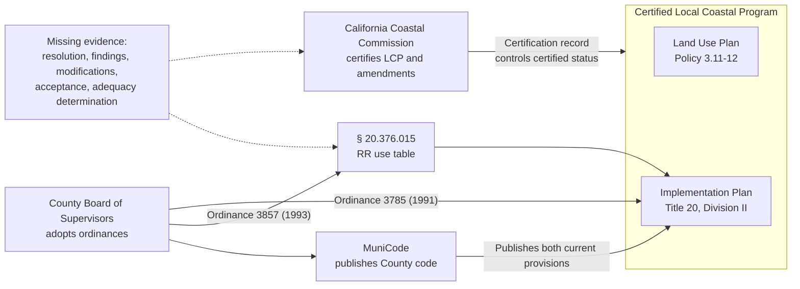

# Ordinance 3857 and the Mendocino County Coastal Code Discrepancy

## A documented conflict between the certified Land Use Plan, the coastal use-type definition, and the Rural Residential zoning table

**Evidence snapshot:** August 2026
**Geographic scope:** Mendocino County coastal zone
**Code scope:** Mendocino County Code, Title 20, Division II
**Central provision:** MCC § 20.376.015, Conditional Uses for RR Districts
**Ordinance:** Mendocino County Ordinance No. 3857, adopted May 10, 1993

> **Important limitation:** This report documents public records, code text, and
> unresolved questions. It does not provide a legal opinion about which text
> governs a particular permit, whether Ordinance 3857 became legally effective
> as part of the certified Local Coastal Program, or what remedy may be
> available. Those determinations belong to the relevant agencies and, where
> appropriate, qualified legal counsel.

---

## Executive summary

Mendocino County's coastal planning documents currently give two different
answers to the same question:

> May an off-site alternative-energy facility be considered as a conditional
> use in the Rural Residential (RR) district?

Two general provisions appear to answer **no**:

1. Certified Land Use Plan Policy 3.11-12 lists Agriculture, Forest Land,
   Range Lands, and Industrial Land as the categories in which off-site
   alternative-energy facilities may be considered as conditional uses.
2. MCC § 20.320.020, sourced to Ordinance 3785 from 1991, lists AG, RL, FL, TP,
   and I districts. It does not list RR.

A later, district-specific provision answers **yes**:

3. MCC § 20.376.015 lists "Alternative Energy Facilities: Off-site" among the
   conditional Coastal Civic Use Types in the RR district. Its source note
   identifies Ordinance 3857, adopted in 1993.

A scanned, signed copy of Ordinance 3857 confirms that the Board of Supervisors
adopted a complete restatement of § 20.376.015 containing the off-site use in
the RR district. The ordinance also states that the Board acted after
considering a "Resolution of Certification" transmitted by the California
Coastal Commission. Correspondence obtained from County staff now indicates
that the Commission proceeding associated with Ordinance 3857 was Minor
Amendment 1-92 and that its identified RR changes concerned fire and police
services, not alternative energy. The ordinance therefore proves that the
energy line was in the text adopted in 1993, but it does not prove that the
line was newly added or reviewed in that amendment.

The present discrepancy is therefore **not a missing-text or MuniCode
ingestion problem**. The current MuniCode publication contains the provision,
and a programmatic review found it in every one of the 46 archived MuniCode
versions available from December 2011 through August 2026.

The unresolved question is instead:

> Did the Coastal Commission's referenced certification action approve the
> specific RR amendment enacted by Ordinance 3857, and if so, how was that
> amendment intended to interact with the older LUP policy and use-type
> definition?

The answer requires the Commission's referenced Resolution of Certification
and associated administrative record. Until that record is obtained, three
material possibilities remain:

1. The energy line was carried forward from an earlier draft or baseline but
   was never included in the text the Commission finally certified.
2. The Commission certified the RR use in an earlier or separate action that
   staff have not yet located.
3. The County adopted text containing the RR use, but that provision never
   became part of the Commission-certified LCP.
4. A certification action was conditional, partial, or otherwise different
   from what the County ultimately enacted.

The key missing item is thus **certification provenance**, not ordinance text.

---

## 1. A plain-language explanation

The discrepancy can be understood as three related configuration files that
were not kept synchronized.

### How the documents relate



MuniCode's role in this diagram is important. The vendor can accurately
publish an ordinance adopted by the County without independently establishing
whether every amendment completed Coastal Commission certification. The
County code and the certified LCP should normally correspond, but they are
distinct evidentiary sources.

### File 1: The general coastal policy

The certified Land Use Plan says, in substance:

```text
Off-site alternative energy may be considered in:
Agriculture, Forest Land, Range Lands, and Industrial Land.
```

RR is not listed.

### File 2: The coastal use-type definition

MCC § 20.320.020 says:

```text
Alternative Energy Facilities: Off-site may be conditionally permitted in:
AG, RL, FL, TP, and I.
```

Again, RR is not listed.

### File 3: The RR district's own use table

Ordinance 3857 amended the RR table to say:

```text
RR conditional uses include:
Alternative Energy Facilities: Off-site.
```

The resulting system contains an internal conflict:

```text
General rule:       RR is not listed.
RR-specific table:  RR expressly includes the use.
```

This resembles a later code change applied to one file without updating two
older files that describe the same feature.

The missing evidence is the upstream review record. Ordinance 3857 says the
Board considered a Coastal Commission Resolution of Certification, but the
resolution and its exhibits have not yet been located. Without them, it is not
possible to tell whether the later RR entry was:

- a certified and intentional exception;
- a County-only amendment that was never finally certified; or
- a response to a Commission action whose precise scope differed from the
  enacted ordinance.

---

## 2. The three controlling texts

### 2.1 Certified LUP Policy 3.11-12

The Mendocino County Coastal Element states:

> "The County shall encourage the development and use of alternative sources
> of energy, such as wind, solar, wave, and biomass and cogeneration to meet
> the coast's energy needs.
>
> Alternative energy facilities for onsite use shall be permitted as a
> conditional use in all land use categories. For off-site use, alternative
> energy facilities shall be considered a conditional use in the Agriculture,
> Forest Land, Range Lands, and Industrial Land categories."

The policy does not name Rural Residential.

This is a Land Use Plan policy. It supplies the certified policy framework
against which the Implementation Plan and later LCP amendments are evaluated.

### 2.2 MCC § 20.320.020

The current coastal use-type definition provides:

> "This use type includes alternate energy facilities related to solar, wind,
> waves, biomass, and cogeneration sources for off-site use shall be permitted
> as a conditional use in AG, RL, FL, TP and I Districts."

Its source note is:

> "(Ord. No. 3785 (part), adopted 1991)"

Like Policy 3.11-12, this provision does not name RR.

### 2.3 MCC § 20.376.015

The current RR conditional-use table provides, in relevant part:

> **Coastal Civic Use Types**
>
> Alternative Energy Facilities: On-site;
> Alternative Energy Facilities: Off-site;
> Community Recreation;
> [...]

Its source note is:

> "(Ord. No. 3785 (part), adopted 1991; Ord. No. 3857, adopted 1993)"

This is the provision that creates the apparent RR authorization.

---

## 3. What the signed Ordinance 3857 establishes

The two-page scanned ordinance is strong contemporaneous evidence.

### 3.1 The ordinance is specifically about the RR district

Its title is:

> **AN ORDINANCE AMENDING CHAPTER 20.376 — RR — RURAL RESIDENTIAL
> DISTRICT — DIVISION II OF TITLE 20 OF THE MENDOCINO COUNTY CODE**

This was not a general or unrelated ordinance later misattributed to the RR
chapter.

### 3.2 The ordinance expressly amends § 20.376.015

Its operative clause states:

> "Having considered the Resolution of Certification transmitted to the
> County of Mendocino from the California Coastal Commission, the Board of
> Supervisors of the County of Mendocino, State of California amends Section
> 20.376.015 of Division II of Title 20 to read as follows:"

The ordinance then restates the complete conditional-use section.

### 3.3 The enacted text expressly includes the disputed use

Under Coastal Civic Use Types, the ordinance lists:

> Alternative Energy Facilities: Onsite
> Alternative Energy Facilities: Offsite

The inclusion was therefore part of the section text enacted in 1993, not an
unexplained editorial note or a later vendor interpolation.

The new Commission correspondence changes the inference that can be drawn
from this fact. Because Ordinance 3857 restates the entire section, it contains
both the language being amended and language carried forward unchanged.
Commission staff identify fire and police services—not alternative energy—as
the RR changes made through Minor Amendment 1-92. The ordinance alone does not
show whether the energy line was part of the amendment's actual change set.

### 3.4 The Board passed and adopted the ordinance

The ordinance records adoption on May 10, 1993:

- Ayes: Supervisors Sugawara, Henry, de Vall, and McMichael
- Noes: None
- Absent: Supervisor Eddie

### 3.5 The ordinance expressly references Commission certification

The recital about a transmitted Resolution of Certification is significant.
It establishes that the County understood its action to be connected to a
Coastal Commission certification proceeding.

However, the County ordinance is not itself the Commission's resolution. It
does not contain:

- the Commission file or LCP amendment number;
- the resolution's full text;
- the Commission's findings;
- suggested modifications;
- exhibits identifying the text reviewed;
- the County's complete acceptance materials; or
- any later Executive Director legal-adequacy determination.

The ordinance is therefore strong evidence of a certification connection, but
the referenced Commission record is still required to prove the exact scope
and final status of certification.

---

## 4. What the 2025 County and Commission correspondence says

### 4.1 The County memorandum

An April 10, 2025 Mendocino County Planning and Building Services memorandum
for the Fern Creek Road Solar Project, PAC_2025-0002, describes a proposed
2 MW solar facility in an RR district.

The memorandum accurately recognizes the first part of the discrepancy:

> "Although AEF:Os is listed as a conditional use within the RR zone
> (§20.376.015), the section defining Coastal Civic Use Types for AEF:Os states
> that those uses may only be permitted as a conditional use within the AG,
> RL, FL, TP and I districts (§20.320.020)."

It also cites LUP Policy 3.11-12 and concludes:

> "The State was unable to provide information suggesting that including the
> use in the RR zone was intentional, so staff is forced to conclude that it
> is an error."

The memorandum therefore does **not** report that the use is missing from the
RR zoning table. It reports an inconsistency and treats the RR entry as an
error because staff could not confirm its intentional, certified status.

The signed ordinance materially affects that reasoning:

- It proves the Board intentionally enacted the RR entry.
- It identifies the exact amending ordinance and adoption date.
- It points to a specific Commission Resolution of Certification.

The memorandum's statement that the State could not provide evidence of
intent may accurately describe what Commission staff located during that
particular inquiry. It does not establish that no such certification record
exists. The administrative record may be indexed under the original
Implementation Plan certification, suggested modifications, a resolution
number, a major or minor LCP amendment number, or a later legal-adequacy
determination rather than under "Ordinance 3857."

The memorandum also states that the apparent error existed "since at least
1987." That date is difficult to reconcile with the source history presently
available:

- § 20.320.020 cites Ordinance 3785, adopted in 1991.
- § 20.376.015 cites Ordinance 3857, adopted in 1993.

There may be earlier draft materials supporting the 1987 date, but those
materials are not identified in the memorandum and have not been located in
this investigation.

### 4.2 The March 2025 Commission staff response

County staff subsequently produced a March 11–12, 2025 email exchange with
North Coast District Commission staff. Supervising Analyst Tamara Gedik
reported the following:

1. The Commission's original IP certification findings say the zoning
   districts mirror the LUP land-use categories.
2. The LUP does not list off-site energy facilities as an allowable
   conditional use in RR.
3. Ordinance 3857 was associated with Minor Amendment 1-92.
4. In the Commission's records, the RR change made by that amendment added
   fire and police services as conditional uses.
5. Although the amendment made other IP changes, Commission staff found no
   other new RR conditional uses in that amendment.
6. Ordinance 3857 shows the alternative-energy line in the section at that
   point in time, but Commission staff could not tell whether that particular
   use "was ever certified in the RR district."
7. Commission records also contain a December 4, 1986 letter commenting on
   draft County ordinances that used different section numbers.

This is important new evidence, but it is not a formal determination that the
energy line was never certified. Commission staff's exact conclusion was
uncertainty: the Minor Amendment 1-92 record does not establish certification
of that line, and staff had not yet connected it to an earlier certified
version.

### 4.3 The difference between what CCC said and what the County concluded

The positions should not be conflated:

| Speaker | What was said |
|---|---|
| Commission staff | The LUP does not allow the use in RR; Minor Amendment 1-92 does not appear to have added it; it is unclear whether the RR use was ever certified |
| County staff | Because the LUP controls and consistency could not be demonstrated, staff would not support a use permit in RR without an LCP amendment/rezone |

Commission staff did not say:

- that Ordinance 3857 is invalid;
- that the Commission affirmatively rejected the energy line;
- that a complete search proved it was never certified; or
- that MuniCode made an error.

The County's practical permitting conclusion is stronger than the historical
finding in the Commission email. County staff decided that, absent affirmative
proof of LCP consistency, they could not process the proposal as an allowed
RR conditional use. That is why they advised that the applicant would likely
need an LCP amendment and rezone to AG, RL, or FL.

### 4.4 The new "git diff" explanation

Ordinance 3857 looks like a complete file:

```text
Replace § 20.376.015 with the following full section ...
```

The Commission's amendment record appears to describe a smaller patch:

```diff
+ Fire Protection Facilities
+ Police Protection Facilities
```

The off-site-energy line appears in the full file, but Commission staff did
not find it in the certified patch for Minor Amendment 1-92. This suggests
that the line may have been inherited from an earlier draft or working
baseline.

The unresolved task is now to find the commit where that inherited line first
entered the baseline and determine whether that baseline was certified. The
highest-value records are the original certified IP text, the 1986 draft and
comment letter, and the complete Minor Amendment 1-92 file.

### 4.5 What the transcribed 1986 review comments add

The three Commission comments embedded in the March 2025 email have now been
transcribed:

> 1. "Section C-20.208.35(A) Alternative energy facilities are not included in
> all land use categories under Conditional Uses."
>
> 2. "Section C-20.068.10(B)(4) LUP refers to alternative energy facilities"
>
> 3. "Section C-20.100.10(A)(2) LUP lists Alternative Energy Sources as a
> conditional use."

These comments show that Commission staff were actively checking the draft
Implementation Plan's alternative-energy provisions against the LUP in 1986.
They also establish that a mismatch existed before final IP certification and
before Ordinance 3857.

The first comment requires particular care. Policy 3.11-12 creates two
different rules:

- **On-site** facilities are conditional uses in all land-use categories.
- **Off-site** facilities are conditional uses only in the listed resource and
  industrial categories.

The shorthand 1986 comment says only "alternative energy facilities" and "all
land use categories." It does not distinguish on-site from off-site. It may
have been directing the County to add the **on-site** use to missing district
tables. It does not, by itself, direct the County to allow **off-site**
facilities in RR.

One plausible drafting pathway is therefore:

1. Commission staff noted that alternative-energy facilities were missing
   from some conditional-use tables.
2. A drafter responded by adding both the on-site and off-site rows together,
   rather than adding only the universally allowed on-site row.
3. The general definition and LUP continued to restrict off-site facilities.
4. The paired rows were carried into later complete section restatements,
   including Ordinance 3857.

That pathway would explain the present inconsistency, but the comments alone
do not prove it. The predecessor citations have not yet been mapped to current
sections, and the excerpts omit the surrounding draft text, the County's
response, and the Commission's final disposition of each comment.

The second and third comments reinforce that reviewers were checking
terminology and LUP consistency. They do not state whether any final wording
was accepted or certified.

---

## 5. What the MuniCode audit establishes

### 5.1 The provision exists in the current publication

MuniCode Supplement 75, posted August 17, 2026 and codified through Ordinance
4558, includes both:

- "Alternative Energy Facilities: Off-site"; and
- the source-note citation to Ordinance 3857.

The content was independently captured through:

1. MuniCode's public JSON API; and
2. a rendered Chrome browser session preserving HTML, text, PDF, screenshot,
   network responses, and a sanitized HAR.

### 5.2 The provision exists throughout retained CodeBank history

The repository's historical tracer resolved § 20.376.015 separately in each
of MuniCode's 46 retained versions:

- Earliest: Supplement 30, December 16, 2011
- Latest: Supplement 75, August 17, 2026

Results:

| Test | Result |
|---|---:|
| Versions examined | 46 |
| Successful historical retrievals | 46 |
| Retrieval errors | 0 |
| Versions containing the off-site line | 46 |
| Versions containing the Ordinance 3857 citation | 46 |
| Substantive presence/absence transitions | 0 |

There was one text-hash transition between Supplements 57 and 58, but a
line-level comparison showed no added or removed textual line. The difference
was formatting or whitespace, not removal of the use.

### 5.3 The historical API formats changed

MuniCode reorganized its historical table of contents over time:

- Some early versions nested Title 20 under a legacy Supplement History
  container.
- One transitional version nested Title 20 under "MENDOCINO COUNTY — ZONING
  ORDINANCE."
- Current versions expose Title 20 directly.

A naive node-ID lookup can therefore return "Content Not Found" even though
the provision exists. The repository tracer navigates each version's actual
table of contents instead of assuming current node IDs work historically.

### 5.4 MuniCode is not the identified source of the discrepancy

The available evidence does not support either of the original vendor-failure
hypotheses:

| Hypothesis | Evidence |
|---|---|
| MuniCode never ingested Ordinance 3857 | Contradicted by current text and all retained versions |
| A later MuniCode supplement removed the provision | Contradicted by the 46-version trace |
| A later County ordinance overwrote § 20.376.015 | No later ordinance appears in its source note |
| A stale or incomplete URL made the section appear absent | Technically plausible and reproducible |
| The provision was absent before December 2011 | Unknown; CodeBank does not retain earlier versions |

The investigation should no longer describe the problem as a demonstrated
MuniCode omission.

### 5.5 Scale of the Division II audit

The current Division II inventory was not limited to a keyword search for
Ordinance 3857. It traversed the complete coastal zoning table of contents and
retrieved every available document record.

| Current Supplement 75 inventory | Count |
|---|---:|
| Chapters | 69 |
| Numbered sections | 546 |
| Total TOC nodes | 618 |
| API document records | 614 |
| Documents containing source notes | 543 |
| Source-note occurrences | 574 |
| Unique ordinance numbers in source notes | 7 |
| Captured inventory size | Approximately 2.4 MB |

The source notes cite these ordinance numbers:

| Ordinance | Source-note citations |
|---|---:|
| 3785 | 476 |
| 3857 | 1 |
| 4083 | 55 |
| 4149 | 13 |
| 4365 | 6 |
| 4418 | 7 |
| 4497 | 35 |

Ordinance 3857 appears only once because its codified change is narrowly
focused on § 20.376.015. That single citation is consistent with the signed
ordinance's title and operative text.

The separate CodeBank audit found 46 retained publication versions. Nine
versions identify Division II documents as recently changed, comprising 67
changed-document entries. Those entries are vendor publication metadata, not
necessarily 67 ordinances or 67 Commission-certified LCP amendments.

### 5.6 What the Code Comparative Table can and cannot show

MuniCode's "Code Comparative Table and Disposition List" initially appeared
to be a possible ordinance-status ledger. For this code, it is principally a
cross-reference between former section numbers and their disposition in the
codification. It is not a complete chronological log of County ordinances,
Commission certifications, or vendor ingestion decisions.

The absence of Ordinance 3857 from that table would therefore not prove that
MuniCode marked it "Not Codified." The provision's actual current text,
source note, and archived section history are more probative of whether the
vendor publishes it.

---

## 6. The actual unresolved question

The central issue is not:

> Where did MuniCode drop Ordinance 3857?

The evidence now answers that question: no drop has been found in the
available MuniCode history.

The central issue is:

> Did the Coastal Commission certify the RR amendment enacted by Ordinance
> 3857, and how was that amendment intended to interact with the older LUP
> policy and § 20.320.020?

This is a certification-provenance problem.

---

## 7. Four plausible certification states

### Scenario A: An uncertified draft line was carried forward

This is the scenario most directly suggested by the new correspondence:

- The energy line existed in a 1986-era draft or another pre-1993 baseline.
- The Commission's original certification action did not approve it for RR.
- Ordinance 3857 later restated the complete section while making unrelated
  certified changes for fire and police services.
- The inherited line remained in the County's codified text without a clear
  certification event.

This scenario is plausible, not proven. It requires comparison of the draft
IP, the final certified IP, and the text submitted and approved in Minor
Amendment 1-92.

### Scenario B: The Commission certified the RR use in another action

Under this scenario:

- The RR entry was approved in the original IP certification or another
  amendment not located in the March 2025 search.
- Ordinance 3857 carried that already-certified provision forward.
- Policy 3.11-12 and § 20.320.020 were not updated to reflect it, leaving an
  internal inconsistency.

Evidence that would support this scenario includes:

- a Commission resolution identifying the RR text;
- suggested modifications directing the County to add it;
- Commission findings explaining LUP consistency;
- a certified replacement page containing the RR use;
- County acceptance followed by an Executive Director determination of legal
  adequacy; or
- a certification index identifying the amendment as effective.

If this scenario is confirmed, the 2025 conclusion that the RR entry was an
unintentional error would require reconsideration.

### Scenario C: The County adopted the RR text without final certification

Under this scenario:

- The Board adopted Ordinance 3857 containing the RR energy line.
- The County codified it, and MuniCode accurately publishes it.
- The Commission did not certify that provision as part of the LCP.

Possible explanations include:

- the County adopted language beyond the Commission's modifications;
- the Commission rejected or excluded the RR text;
- the County never completed a required acceptance or resubmittal;
- the Executive Director never found the County's action legally adequate; or
- the amendment was withdrawn or superseded.

If confirmed, this scenario would explain why the provision appears in the
County code while County staff nevertheless considers it unavailable for
coastal permitting.

### Scenario D: The certification action was conditional or ambiguous

The Commission may have conditionally certified a broader amendment, while
the County and Commission understood the resulting text differently. The
resolution, findings, and correspondence would be necessary to determine:

- which text was before the Commission;
- which modifications were required;
- whether the County's action matched them; and
- when or whether certification became effective.

---

## 8. Why the referenced Resolution of Certification is decisive

The resolution can answer questions that the County ordinance, MuniCode, and
LUP text cannot answer independently:

1. What matter was the Commission certifying?
2. What exact text did Commission staff review?
3. Did the reviewed text include RR?
4. Was certification unconditional or subject to modifications?
5. Did the Commission make findings about consistency with Policy 3.11-12?
6. Was the County expected to amend § 20.320.020 or the LUP as well?
7. Did Ordinance 3857 constitute the County's acceptance of Commission
   modifications?
8. Did the Executive Director subsequently determine that the County's action
   was legally adequate?
9. What final text entered the certified LCP?

The ordinance itself supplies a strong search lead, but not those answers.

---

## 9. Records needed for a definitive determination

A Public Records Act request has been prepared for the following categories.

### 9.1 Original and amendment certification records

- The Resolution of Certification referenced in Ordinance 3857
- Transmittal letter and all exhibits
- Commission staff report and addenda
- Findings, suggested modifications, and adopted motion
- Agenda, minutes, vote record, transcript, and available recording
- LCP amendment, docket, agenda-item, and resolution numbers
- County submittal, resubmittal, and completeness correspondence
- Every reviewed version of §§ 20.320.020 and 20.376.015
- Any amendment or consistency analysis for LUP Policy 3.11-12
- County acceptance materials
- Executive Director legal-adequacy determination
- Final certified LUP and IP replacement pages
- Records of rejection, withdrawal, exclusion, or later correction

### 9.2 Records underlying the 2025 County conclusion

- The County's exact inquiry to Commission staff
- Commission staff's complete response
- All attachments and records exchanged
- The complete Minor Amendment 1-92 file
- The December 4, 1986 Commission comment letter to Jerry Heath
- The draft County ordinances reviewed with that letter
- The initially certified version of § 20.376.015
- Internal Commission research notes and communications
- Files, databases, indices, and archives searched
- Records agreeing with or questioning the County's conclusion
- Any later Commission review of the signed Ordinance 3857

### 9.3 Archive and records-management information

If the certification file cannot be immediately produced, the agencies should
identify:

- file titles and numbers;
- LCP amendment indices;
- box, accession, and transfer numbers;
- storage locations;
- State Archives transfers;
- applicable retention schedules; and
- any destruction or disposition record.

---

## 10. Chronology

| Date | Event | Evidentiary status |
|---|---|---|
| Nov. 20, 1985 | Mendocino Coastal LUP certified | Documented |
| 1985 | LUP Policy 3.11-12 lists four off-site categories, not RR | Documented |
| Mar. 15, 1991 | Implementation Plan certified with modifications | Documented in later County/Commission materials |
| 1991 | Ordinance 3785 supplies § 20.320.020 and original Division II source notes | Documented in current code |
| July 22, 1991 | County adopted certification modifications | Documented in later County/Commission materials |
| Sept. 10, 1992 | Total LCP reported effectively certified | Documented in later LCP materials |
| Oct. 13, 1992 | County assumed coastal permit authority | Documented in later LCP materials |
| Dec. 4, 1986 | Commission staff identified alternative-energy inconsistencies in draft ordinances using predecessor section numbers | Three comments transcribed; surrounding draft and final disposition not yet obtained |
| May 10, 1993 | Board adopted Ordinance 3857 restating § 20.376.015 with the off-site use present | Proven by signed ordinance |
| 1993 | Ordinance states Board considered a Commission Resolution of Certification | Proven as a County recital; underlying resolution missing |
| Dec. 16, 2011 | Earliest retained MuniCode version already contains the provision | Programmatically verified |
| Dec. 2011–Aug. 2026 | Provision remains present in all 46 retained versions | Programmatically verified |
| Mar. 11–12, 2025 | Commission staff identify Minor Amendment 1-92, say its RR changes concerned fire and police, and state energy-use certification remains unclear | Documented in email correspondence |
| Apr. 10, 2025 | County PAC memorandum treats RR entry as error after Commission inquiry | Documented |
| Aug. 17, 2026 | Current MuniCode Supplement 75 contains provision and source note | Programmatically verified |

---

## 11. Findings: proven, supported, and unresolved

### Proven

1. Ordinance 3857 was passed and adopted by the Board on May 10, 1993.
2. It restated the complete RR conditional-use section.
3. The restated section expressly contains "Alternative Energy Facilities:
   Offsite."
4. It recites a Coastal Commission Resolution of Certification.
5. Current § 20.376.015 contains the provision and cites Ordinance 3857.
6. Every retained MuniCode version from 2011 through 2026 contains it.
7. § 20.320.020 and LUP Policy 3.11-12 do not list RR.
8. The current body of coastal planning text is internally inconsistent.
9. Commission staff associate Ordinance 3857 with Minor Amendment 1-92.
10. Commission staff found that amendment's RR changes concerned fire and
    police services, not alternative energy.
11. Commission staff expressly said it remains unclear whether the energy use
    was ever certified in RR.

### Strongly supported

1. The RR entry is not an accidental MuniCode transcription.
2. The Board adopted a complete section that contained the entry.
3. No currently identified later ordinance removed or superseded it.
4. The discrepancy predates the accessible MuniCode archive.
5. A certification proceeding related to the County action existed, although
   its precise scope remains unknown.
6. Minor Amendment 1-92 is not the demonstrated certification event for the
   energy line.

### Unresolved

1. Whether the Commission certified the specific RR language.
2. Whether certification was conditional.
3. Whether Ordinance 3857 matched the Commission's required modifications.
4. Whether the Commission found the County's action legally adequate.
5. Whether Policy 3.11-12 was amended or interpreted to permit the RR entry.
6. Whether the RR entry is legally operative for coastal permit decisions.
7. Why County staff reported an error dating to at least 1987.
8. What records Commission staff searched in connection with PAC_2025-0002.
9. Whether the line appears in the 1986 draft, the initially certified IP, or
   both.
10. Which current sections correspond to draft §§ C-20.208.35(A),
    C-20.068.10(B)(4), and C-20.100.10(A)(2).
11. How the County responded to each 1986 comment and how Commission staff
    closed it before certification.

---

## 12. Recommended terminology

To avoid overstating the evidence, public communications should use:

> **"An unresolved inconsistency between the certified LUP policy, the coastal
> use-type definition, and the later RR district amendment enacted by Ordinance
> 3857."**

Until a version showing an actual omission is produced, communications should
not characterize the matter as:

- a proven MuniCode ingestion failure;
- a lost ordinance;
- a later overwrite;
- an accidental Board action; or
- a definitively uncertified amendment.

A concise and supportable description is:

> Ordinance 3857 restated the RR conditional-use table in 1993 with off-site
> alternative-energy facilities included and references a Coastal Commission
> Resolution of Certification. Commission staff report that the corresponding
> Minor Amendment 1-92 changed RR uses for fire and police services, not
> alternative energy, and say it remains unclear whether the energy use was
> ever certified in RR. The provision remains in the current code and
> throughout all retained MuniCode history.

---

## 13. Reproducing the code audit

This repository contains tools that use MuniCode's public APIs and a local
Chrome browser.

### Fetch the current RR section

```sh
npm run fetch:section -- \
  --section 20.376.015 \
  --expect 'Alternative Energy Facilities: Off-site' \
  --expect 'Ord. No. 3857'
```

### Fetch the conflicting use-type definition

```sh
npm run fetch:section -- \
  --section 20.320.020 \
  --expect 'AG, RL, FL, TP and I Districts'
```

### Trace the RR section through all retained versions

```sh
npm run trace:section -- \
  --section 20.376.015 \
  --text 'Alternative Energy Facilities: Off-site' \
  --text 'Ord. No. 3857'
```

### Inventory Division II

```sh
npm run inventory:division-ii
npm run history:division-ii
```

### Open the visual explorer

```sh
npm run explorer
```

Then open <http://127.0.0.1:4173>.

---

## 14. Sources

1. **Mendocino County Ordinance No. 3857**, adopted May 10, 1993. Scanned
   two-page copy supplied for this investigation.
2. **Mendocino County Code § 20.376.015**, Conditional Uses for RR Districts,
   current MuniCode publication:
   <https://library.municode.com/ca/mendocino_county/codes/code_of_ordinances?nodeId=MECOCO_TIT20ZOOR_DIVIIMECOCOZOCO_CH20.376URREDI_S20.376.015COUSRRDI>.
3. **Mendocino County Code § 20.320.020**, Alternative Energy Facilities:
   Off-site, current MuniCode publication:
   <https://library.municode.com/ca/mendocino_county/codes/code_of_ordinances?nodeId=MECOCO_TIT20ZOOR_DIVIIMECOCOZOCO_CH20.320COCIUSTY_S20.320.020ALENFAOTE>.
4. **Mendocino County General Plan Coastal Element**, Policy 3.11-12,
   certified Land Use Plan text, Internet Archive item:
   <https://archive.org/details/C124888154>.
5. **Mendocino County Planning and Building Services**, memorandum regarding
   PAC_2025-0002, Fern Creek Road Solar Project, April 10, 2025, especially
   pages 3–5.
6. **Mendocino County and California Coastal Commission staff
   correspondence**, "LCP/Zoning Inconsistency," March 11–12, 2025, preserved
   in [`from_russell.txt`](../from_russell.txt).
7. **California Coastal Commission / Mendocino County LCP grant materials**,
   containing the reported LCP certification timeline:
   <https://documents.coastal.ca.gov/assets/lcp/grants/Round%208/MendocinoRound8Application.pdf>.
8. MuniCode CodeBank public version metadata and Recent Changes APIs, captured
   and reproducible through the scripts in this repository.

---

## Conclusion

The evidence has narrowed the problem substantially.

Ordinance 3857 was not lost from the current coastal zoning code, and no loss
event appears in the complete MuniCode history available from 2011 forward.
The Board adopted a complete RR section containing the disputed language, and
the ordinance expressly connects its action to a Coastal Commission
Resolution of Certification.

The March 2025 correspondence supplies an important qualification: Commission
staff associate Ordinance 3857 with Minor Amendment 1-92, whose identified RR
changes added fire and police services rather than alternative energy. In
software terms, the energy line was present in the complete file but not in
the amendment diff that staff located. Commission staff therefore did not
confirm or deny certification of the line; they said its certification remains
unclear.

At the same time, the older LUP policy and coastal use-type definition do not
list RR. The result is a genuine internal inconsistency with potentially
important consequences for renewable-energy permitting in the coastal zone.

The decisive next step is not another search of current MuniCode. It is a
baseline comparison: the 1986 draft, the initially certified IP, and the
complete Minor Amendment 1-92 administrative record. Those documents can show
whether the line began as draft text that was excluded from certification or
as certified text later carried forward.
